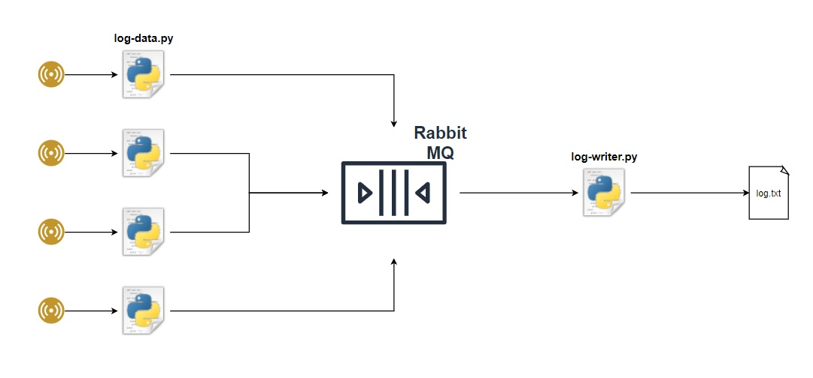

Information and Instructions
___

###Dependencies 

1. Python 3.8

2. PIP

3. RabbitMQ
    - _`'docker run -it --rm --name rabbitmq -p 5672:5672 -p 15672:15672 rabbitmq:3-management'`_
        - OR
    - https://www.rabbitmq.com/download.html 
        - install Erlang
        - install RabbitMQ
        - start rabbitmq service
            - this should be kept running 
    
4. Python VENV (OPTIONAL, but preferred to keep python installation lib clean). 
   Launch CMD in checked out directory and execute:
    - `_'python -m venv ./venv'_`
    - `_'.\venv\Scripts\activate.bat'_`

    NOTE - If you are using the virtualenv, then all solution executions should be performed in the virtual environment.
    
5. Pika package for RabbitMQ
    - `_'pip install pika'_`
    
---

###Configuration Changes Needed

1. LogProducer\config.py
    - APPLICATION_PATH : Path of the sensor application
    - APPLICATION_NAME : Name of the sensor application

2. LogConsumer\config.py
    - FILE_PATH : Directory where file is to be generated
    - FILE_NAME : Name of the log file 

---

### Modules
There are two components as part of this solution.
1. LogProducer
2. LogConsumer

Each component will work independent of the other.

#####Launch LogProducer - N Instances
- `_'start-log-reader.bat'_` in a cmd prompt
- Python 
    - cd to ./LogProducer directory
    - `_'python log-reader.py {SENSOR_NAME}'_`

---

#####Launch LogConsumer - 1 Instance
- `_'start-log-writer.bat'_` in a cmd prompt
- Python 
    - cd to ./LogConsumer directory
    - `_'python log-writer.py'_`

---

####LogProducer - N Instances

The LogProducer module performs the following operations
1. Launches the sensor emulator and reads the STDIO
2. Parses the packets to json format
3. Saves partial packets received and combines with subsequent sensor data received. No packet loss.
4. Dispatches the logs in configurable batch sizes to the RabbitMQ 

---

####LogConsumer - 1 Instance

The LogConsumer modules performs the following operations
1. Listens to the RabbitMQ queue for log messages
2. On receiving the message writes to the log file 
3. Multiple instances can be launched, and messages will be shared between the instances
4. There WILL be read-write collisions on the file being accessed if multiple instances are launched. 

